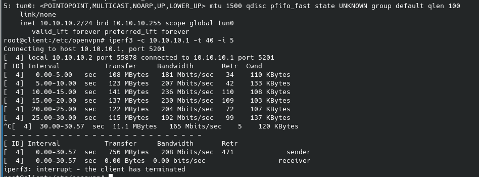
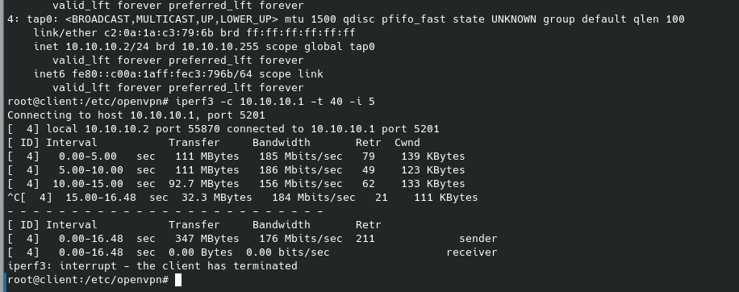

# VPN 

1. Настроил VPN между двумя машинами с сертификатами.
2. Проверил iperf что в режиме tun  cкорость выше чем в режиме tap 
3. Поднял RAS на базе OpenVPN с клиентскими сертификатами, подключиться с клиентской машины

